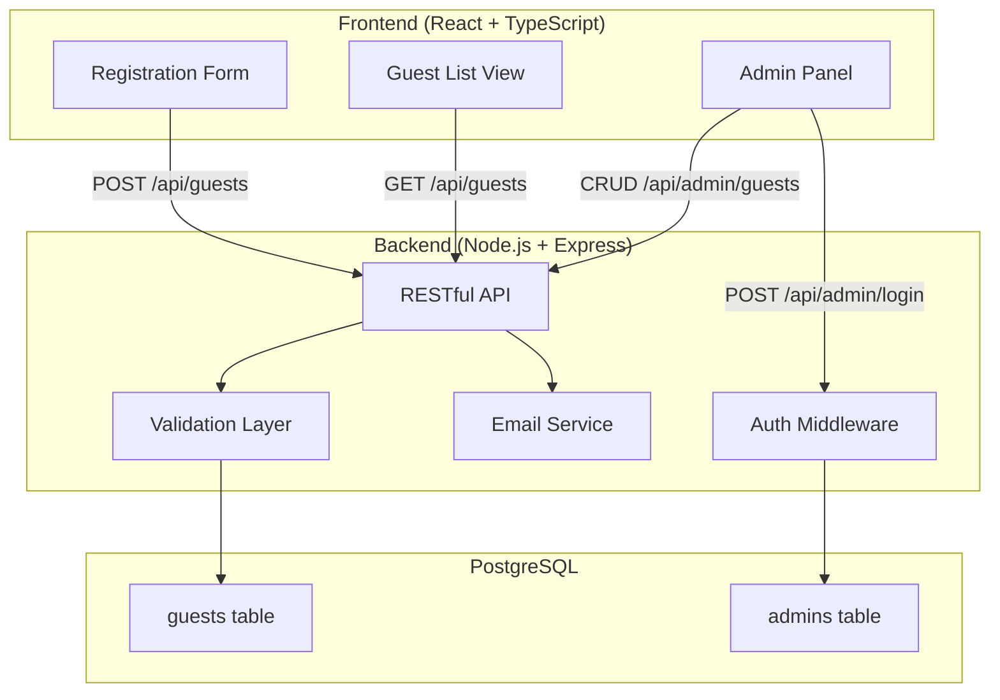

# Design Document: Baby Shower Guest Registration

## Overview

This design describes a full-stack web application for baby shower guest registration. The system consists of a React frontend with a blue baby boy theme, a Node.js/Express backend exposing a RESTful API, and a PostgreSQL database for persistent storage. The application supports three user roles: guests (public registration), the host (guest list view), and administrators (authenticated CRUD panel with approval workflow and email notifications).

### Key Design Decisions

- **React + TypeScript frontend**: Provides type safety, component reusability, and a rich ecosystem for building the themed UI.
- **Node.js/Express backend**: Lightweight, well-supported framework for RESTful APIs with excellent TypeScript support.
- **PostgreSQL database**: Robust relational database with strong data integrity guarantees (atomic transactions, unique constraints).
- **JWT-based authentication**: Stateless authentication for the admin panel, simpler than session-based approaches for a single-admin system.
- **Resend for email**: Modern email API with simple SDK, free tier of 100 emails/day (more than sufficient for baby shower guest notifications).

## Architecture

The application follows a standard three-tier architecture:



### Request Flow

1. Frontend makes HTTPS requests to the Express API.
2. Public routes (registration, guest list) pass through validation middleware.
3. Admin routes pass through JWT authentication middleware first, then validation.
4. Validated requests are processed by service functions that interact with the database.
5. On approval status change (Pending → Approved), the email service sends a notification asynchronously.

## Components and Interfaces

### Frontend Components

| Component | Responsibility |
|-----------|---------------|
| `RegistrationForm` | Public form with name, email, RSVP status fields. Client-side validation, submission handling, confirmation/error messages. |
| `GuestListView` | Displays all guests in a table with status counts. Auto-refreshes via polling (every 5 seconds). |
| `AdminLogin` | Login form for admin authentication. Stores JWT in memory. |
| `AdminPanel` | Authenticated CRUD table with filter by RSVP status, search by name/email, inline edit, delete with confirmation, and approve action. |
| `ThemeProvider` | Wraps app in blue baby boy theme (CSS variables, decorative elements). |

### Backend API Endpoints

| Method | Endpoint | Auth | Description |
|--------|----------|------|-------------|
| `POST` | `/api/guests` | None | Register or update a guest (upsert by email) |
| `GET` | `/api/guests` | None | Retrieve all guests (sorted by timestamp desc) |
| `POST` | `/api/admin/login` | None | Authenticate admin, return JWT |
| `GET` | `/api/admin/guests` | JWT | Retrieve all guests (with filter/search query params) |
| `PUT` | `/api/admin/guests/:id` | JWT | Update a guest record |
| `DELETE` | `/api/admin/guests/:id` | JWT | Delete a guest record |
| `POST` | `/api/admin/guests/:id/approve` | JWT | Approve a pending registration |

### Backend Services

| Service | Responsibility |
|---------|---------------|
| `GuestService` | Business logic for guest CRUD, upsert, validation, approval |
| `AuthService` | Admin credential verification, JWT token generation/validation |
| `EmailService` | Sends approval email via SMTP, tracks sent emails to prevent duplicates |
| `ValidationService` | Input validation (name length, email format, RSVP enum) |

### API Request/Response Contracts

**POST /api/guests** (Register/Update)
```typescript
// Request
interface RegisterGuestRequest {
  name: string;        // 1-100 characters
  email: string;       // valid email, max 254 characters
  rsvpStatus: 'Attending' | 'Not Attending' | 'Undecided';
}

// Response 201 (Created) or 200 (Updated)
interface RegisterGuestResponse {
  message: string;     // Confirmation message (new or updated)
  guest: {
    id: string;
    name: string;
    email: string;
    rsvpStatus: string;
    approvalStatus: 'Pending';
    submittedAt: string; // ISO 8601 UTC
  };
}

// Response 400 (Validation Error)
interface ValidationErrorResponse {
  errors: Array<{
    field: string;
    message: string;
  }>;
}
```

**POST /api/admin/login**
```typescript
// Request
interface LoginRequest {
  username: string;
  password: string;
}

// Response 200
interface LoginResponse {
  token: string; // JWT
}

// Response 401
interface UnauthorizedResponse {
  error: string;
}
```

**POST /api/admin/guests/:id/approve**
```typescript
// Response 200
interface ApproveResponse {
  message: string;
  guest: GuestRecord;
  emailSent: boolean; // false if email failed
  emailWarning?: string; // present if email failed
}
```

## Data Models

### Guest Record

```typescript
interface GuestRecord {
  id: string;                // UUID primary key
  name: string;              // 1-100 characters
  email: string;             // unique, case-insensitive, max 254 chars
  rsvpStatus: 'Attending' | 'Not Attending' | 'Undecided';
  approvalStatus: 'Pending' | 'Approved';
  approvalEmailSent: boolean; // tracks whether email was sent
  submittedAt: Date;          // UTC timestamp, second precision
  updatedAt: Date;            // UTC timestamp of last update
}
```

### Admin Record

```typescript
interface AdminRecord {
  id: string;           // UUID primary key
  username: string;     // unique
  passwordHash: string; // bcrypt hash
}
```

### Database Schema (PostgreSQL)

```sql
CREATE TABLE guests (
  id UUID PRIMARY KEY DEFAULT gen_random_uuid(),
  name VARCHAR(100) NOT NULL,
  email VARCHAR(254) NOT NULL,
  rsvp_status VARCHAR(20) NOT NULL CHECK (rsvp_status IN ('Attending', 'Not Attending', 'Undecided')),
  approval_status VARCHAR(20) NOT NULL DEFAULT 'Pending' CHECK (approval_status IN ('Pending', 'Approved')),
  approval_email_sent BOOLEAN NOT NULL DEFAULT FALSE,
  submitted_at TIMESTAMP WITH TIME ZONE NOT NULL DEFAULT NOW(),
  updated_at TIMESTAMP WITH TIME ZONE NOT NULL DEFAULT NOW(),
  CONSTRAINT unique_email UNIQUE (LOWER(TRIM(email)))
);

CREATE INDEX idx_guests_rsvp_status ON guests(rsvp_status);
CREATE INDEX idx_guests_approval_status ON guests(approval_status);
CREATE INDEX idx_guests_submitted_at ON guests(submitted_at DESC);
CREATE INDEX idx_guests_name_lower ON guests(LOWER(name));
CREATE INDEX idx_guests_email_lower ON guests(LOWER(email));

CREATE TABLE admins (
  id UUID PRIMARY KEY DEFAULT gen_random_uuid(),
  username VARCHAR(50) NOT NULL UNIQUE,
  password_hash VARCHAR(255) NOT NULL
);
```

### Email Deduplication Logic

The `approval_email_sent` boolean column ensures at most one approval email per guest:
- On approval action: check `approval_status = 'Pending'` AND `approval_email_sent = FALSE`
- After sending email: set `approval_email_sent = TRUE` in the same transaction
- If email fails: leave `approval_email_sent = FALSE`, return warning to admin
- Subsequent edits to an already-approved record: skip email (check `approval_status` is already `'Approved'`)

## Correctness Properties

*A property is a characteristic or behavior that should hold true across all valid executions of a system — essentially, a formal statement about what the system should do. Properties serve as the bridge between human-readable specifications and machine-verifiable correctness guarantees.*

### Property 1: Registration round-trip persistence

*For any* valid guest registration (name 1–100 chars, valid email ≤254 chars, valid RSVP status), persisting it and then retrieving it should yield a record with all fields matching the original input, an `approvalStatus` of "Pending", and a `submittedAt` timestamp within 1 second of the current time.

**Validates: Requirements 1.2, 4.1**

### Property 2: Missing field validation

*For any* registration submission where one or more required fields (name, email, rsvpStatus) are absent or empty, the validation layer should reject the submission and return errors that reference exactly the missing fields, with no false positives for fields that were provided.

**Validates: Requirements 1.3**

### Property 3: Email format validation

*For any* string that does not contain exactly one "@" followed by a domain containing at least one dot, the validation layer should reject it as an invalid email address.

**Validates: Requirements 1.4**

### Property 4: Upsert by normalized email

*For any* guest registration followed by a second submission with the same email address (varying in case and leading/trailing whitespace) but a different RSVP status, the system should contain exactly one record for that email, the record's RSVP status should match the second submission, and the response should indicate an update rather than a new creation.

**Validates: Requirements 1.6, 5.1, 5.2**

### Property 5: Guest list ordering

*For any* set of guest registrations with distinct timestamps, retrieving the guest list should return records sorted by `submittedAt` in descending order (most recent first).

**Validates: Requirements 2.1**

### Property 6: RSVP status counts accuracy

*For any* set of guest registrations with arbitrary RSVP statuses, the reported "Attending" count should equal the actual number of records with status "Attending", and the "Not Attending" count should equal the actual number of records with status "Not Attending".

**Validates: Requirements 2.2, 2.3**

### Property 7: Admin edit persistence

*For any* existing guest record and any valid edit (name 1–100 chars, valid email ≤254 chars, valid RSVP status) that does not conflict with another record's email, submitting the edit and then retrieving the record should yield the updated values.

**Validates: Requirements 6.6**

### Property 8: Admin deletion removes record

*For any* existing guest record, when the admin confirms deletion, the record should no longer be retrievable from the database and should not appear in any subsequent guest list queries.

**Validates: Requirements 6.9**

### Property 9: Email uniqueness constraint on edit

*For any* two guest records with distinct emails, attempting to edit one record's email to match the other's (after case-insensitive comparison and trimming whitespace) should be rejected with a uniqueness error, and neither record should be modified.

**Validates: Requirements 6.11**

### Property 10: Filter by RSVP status

*For any* set of guest records and any valid RSVP status filter value, the filtered results should contain exactly the records whose `rsvpStatus` matches the filter, with no omissions and no false inclusions.

**Validates: Requirements 6.12**

### Property 11: Search by case-insensitive substring

*For any* set of guest records and any non-empty search string, the search results should contain exactly the records where the search string appears as a case-insensitive substring of either the name or email field.

**Validates: Requirements 6.13**

### Property 12: Approval status transition

*For any* guest record with `approvalStatus` of "Pending", executing the approve action should change `approvalStatus` to "Approved" and persist the change.

**Validates: Requirements 6.15**

### Property 13: Approval email content

*For any* guest registration that is approved, the generated approval email should contain the guest's name, their RSVP status, the text "Baby Shower" in both the subject line and body, and a confirmation message.

**Validates: Requirements 7.2, 7.3**

### Property 14: At most one approval email per guest

*For any* sequence of operations on a single guest record (edits, approvals, further edits), the email service should be invoked at most once for that guest, corresponding to the single transition from "Pending" to "Approved".

**Validates: Requirements 7.5, 7.6, 7.7**

## Error Handling

### Frontend Error Handling

| Scenario | Behavior |
|----------|----------|
| Validation error on registration | Display field-specific error messages, preserve filled fields |
| Server error on registration | Display generic "could not save" error, preserve form data |
| Server error on guest list load | Display error message with "Retry" button |
| Network timeout | Display "connection issue" message, suggest retry |
| Admin login failure | Display "invalid credentials" message, clear password only |
| Admin edit/delete failure | Display error toast, preserve unsaved changes |

### Backend Error Handling

| Scenario | HTTP Status | Response |
|----------|-------------|----------|
| Validation failure | 400 | `{ errors: [{ field, message }] }` |
| Invalid credentials | 401 | `{ error: "Invalid credentials" }` |
| Missing/expired JWT | 401 | `{ error: "Authentication required" }` |
| Email uniqueness conflict | 409 | `{ error: "Email already in use", field: "email" }` |
| Database connection failure | 503 | `{ error: "Service temporarily unavailable" }` |
| Database write failure | 500 | `{ error: "Could not save data" }` |
| Email send failure (on approve) | 200 | `{ ..., emailSent: false, emailWarning: "..." }` |
| Record not found | 404 | `{ error: "Guest not found" }` |

### Error Recovery Strategies

- **Database failures**: Return meaningful error to client with retry guidance. Do not partially commit (use transactions).
- **Email failures**: Approval status is saved regardless. Warning returned to admin. Email can be retried by re-triggering approval logic (idempotent due to `approval_email_sent` flag).
- **JWT expiration**: Frontend detects 401, redirects to login. Unsaved form data preserved in component state.

## Testing Strategy

### Unit Tests

Unit tests cover specific examples, edge cases, and error conditions:

- **Validation**: Boundary values for name (0, 1, 100, 101 chars), email edge cases (empty, too long, special characters), RSVP enum values
- **Email normalization**: Specific cases like `" User@Example.COM "` → `"user@example.com"`
- **Empty state rendering**: Guest list with zero records shows correct message and counts
- **Auth flow**: Correct vs incorrect credentials, expired tokens
- **Error states**: Database failures, email failures, network issues
- **UI components**: Form rendering, button visibility (approve button for pending only)

### Property-Based Tests

Property-based tests validate universal correctness properties using `fast-check` (TypeScript PBT library):

- **Library**: `fast-check` (mature, well-maintained, TypeScript-native)
- **Minimum iterations**: 100 per property test
- **Tag format**: `Feature: baby-shower-guest-registration, Property {N}: {title}`
- Each of the 14 correctness properties above maps to one property-based test
- Generators will produce:
  - Random valid names (1–100 alphanumeric + space strings)
  - Random valid emails (format: `{local}@{domain}.{tld}`)
  - Random invalid emails (missing @, multiple @, no dot)
  - Random RSVP statuses from the enum
  - Random operation sequences (register, edit, delete, approve)

### Integration Tests

Integration tests verify system components working together:

- Full registration flow (form → API → database → confirmation)
- Guest list polling and update
- Admin CRUD workflow against a real test database
- Approval workflow with mocked email service
- Database durability across server restarts
- Response time assertions (< 2 seconds for retrieval)
- HTTPS connectivity

### Accessibility Tests

- Automated axe-core scans for WCAG 2.1 AA compliance
- Color contrast ratio verification (≥ 4.5:1)
- Keyboard navigation through all forms
- Screen reader label verification

